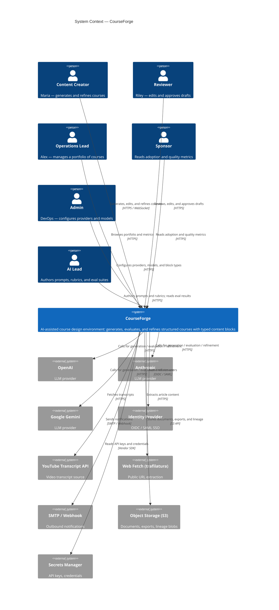

# 07 System Context Diagram

> Document type: Architecture — System Context (C4 Level 1)
> Companion to: `01 Project Charter.md`, `02 Business Requirements Document.md`, `03 Product Requirements Document.md`, `04 Functional Requirements.md`, `05 Non-Functional Requirements.md`, `06 User Stories.md`
> Status: Draft v0.1 · Owner: Architecture · Last updated: 2026-06-05
> This document is the C4 Level 1 (System Context) view. Container and
> Component views are in `08 C4 Architecture.md`.

---

## 1. Document Control

| Field | Value |
|---|---|
| Project codename | CourseForge |
| Document version | 0.1 (Draft) |
| Author | Architecture |
| Reviewers | Backend Lead, AI Lead, Frontend Lead, DevOps Lead |
| Approvers | Head of Engineering |
| Cadence | Reviewed at the end of each sprint |

---

## 2. Purpose

The System Context diagram answers the question:
**"What is the system, who uses it, and what does it depend on?"**

It defines the system boundary and identifies the external actors and
systems that CourseForge integrates with. It deliberately does **not**
show internal structure — that is the job of the C4 Container and
Component views in `08 C4 Architecture.md`.

---

## 3. Actors

| ID | Actor | Type | Description |
|---|---|---|---|
| A-1 | Content Creator (Maria) | User | Instructional designer / course author. Generates and refines courses. |
| A-2 | Reviewer (Riley) | User | Edits and approves generated drafts. |
| A-3 | Operations Lead (Alex) | User | Manages a portfolio of courses. |
| A-4 | Sponsor | User | Reads adoption and quality metrics. |
| A-5 | Admin (DevOps) | Admin | Configures providers, models, quotas, and block types. |
| A-6 | AI Lead | Internal | Authors prompts, rubrics, and eval suites. |

---

## 4. External Systems

| ID | System | Type | Purpose |
|---|---|---|---|
| E-1 | OpenAI | LLM Provider | Adapter behind `LLMProvider` port. |
| E-2 | Anthropic | LLM Provider | Adapter behind `LLMProvider` port. |
| E-3 | Google (Gemini) | LLM Provider | Adapter behind `LLMProvider` port. |
| E-4 | Identity Provider | Auth | OIDC / SAML SSO. |
| E-5 | YouTube Transcript API | Content Source | Fetching video transcripts. |
| E-6 | Web Fetch (trafilatura) | Content Source | Fetching public URLs. |
| E-7 | SMTP / Webhook | Notification | Outbound notifications. |
| E-8 | Object Storage (S3) | Storage | Documents, exports, lineage blobs. |
| E-9 | Secrets Manager | Infrastructure | API keys, DB credentials. |

---

## 5. System Boundary

CourseForge is **one system**. Inside the boundary:

- **Web Application** — Vite + React + TypeScript + react-flow.
- **API Service** — FastAPI + Pydantic v2 (async).
- **Worker Service** — async Python jobs (generation, refinement, export).
- **Postgres** — relational store (courses, jobs, audit, lineage).
- **Neo4j** — graph store (concepts, prerequisites).
- **Redis / Queue** — job broker and cache.

Outside the boundary: all items in §4.

---

## 6. C4 Level 1 — System Context Diagram

---

## 7. Notes on Relationships

| From → To | Why | Failure mode |
|---|---|---|
| User → CourseForge | Primary user journey (generate → review → export) | Auth failure → 401; service down → maintenance page |
| Admin → CourseForge | Configure providers, models, block types | Insufficient role → 403 |
| AI Lead → CourseForge | Author prompts, rubrics, evals | Same as above |
| CourseForge → LLM Provider | Generation, evaluation, refinement | Outage → failover or `termination_reason=budget_exhausted`/`infra_failure` (ADR-0012) |
| CourseForge → IDP | Authentication | IDP outage → read-only mode; emergency local admin login |
| CourseForge → YouTube | Source ingestion | Failure → structured `issue` with `code=YOUTUBE_UNAVAILABLE` |
| CourseForge → Web Fetch | Source ingestion | Failure → structured `issue` with `code=URL_FETCH_FAILED` |
| CourseForge → SMTP | Outbound notifications | Failure → retry; eventually log + in-app only |
| CourseForge → S3 | Document and export storage | Failure → generation blocked with structured `issue` |
| CourseForge → Secrets | Credentials | Failure → app refuses to start (fail-closed) |

---

## 8. Trust Boundaries

| ID | Boundary | Inside | Outside |
|---|---|---|---|
| B-1 | Public internet ↔ CourseForge | CourseForge | End-user devices |
| B-2 | CourseForge ↔ LLM providers | CourseForge | Untrusted provider content (NFR-SEC-006) |
| B-3 | CourseForge ↔ IDP | CourseForge | Auth provider |
| B-4 | Tenant boundary | One tenant | Other tenants (FR-CX-006, FR-UM-003) |

User-supplied context (text instructions, document contents) is treated
as **untrusted input** at boundary B-2 (NFR-SEC-006). The system applies
sanitization, length caps, and structural validation before any user
content is included in a prompt.

---

## 9. Data Classification

| Class | Examples | Storage |
|---|---|---|
| Customer content (sensitive) | Generated courses, user feedback, uploaded documents | Postgres + S3, tenant-isolated, encrypted at rest |
| Customer content (operational) | Job metadata, audit log | Postgres, tenant-isolated |
| Derived data | Agent traces, lineaged blobs | Postgres + S3, tenant-isolated, retention-bounded |
| Secrets | Provider API keys, DB credentials | Secrets manager only; never logged |
| Telemetry | Metrics, traces, logs | Observability stack; no PII; no prompts in prod logs |

---

## 10. Cross-References

- **C4 Container & Component** — `08 C4 Architecture.md`
- **ADRs** — `09 Architecture Decision Records.md`
- **Sequence Diagrams** — `10 Sequence Diagrams.md`
- **JSON Output Contract** — `02 Business Requirements Document.md` §11
- **Functional Requirements** — `04 Functional Requirements.md`
- **Non-Functional Requirements** — `05 Non-Functional Requirements.md`
