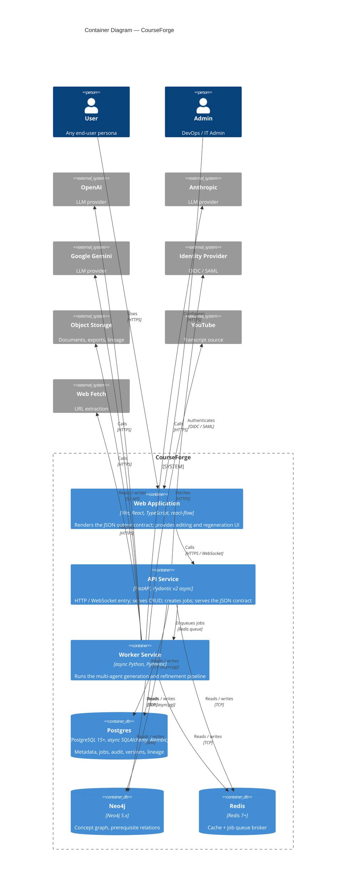

# 08 C4 Architecture

> Document type: Architecture — C4 Container (Level 2) & Component (Level 3)
> Companion to: `07 System Context Diagram.md`
> Status: Draft v0.1 · Owner: Architecture · Last updated: 2026-06-05
> This document contains the C4 Level 2 (Container) and Level 3 (Component)
> views. Level 1 is in `07 System Context Diagram.md`.

---

## 1. Document Control

| Field | Value |
|---|---|
| Project codename | CourseForge |
| Document version | 0.1 (Draft) |
| Author | Architecture |
| Reviewers | Backend Lead, AI Lead, Frontend Lead, DevOps Lead |
| Approvers | Head of Engineering |
| Cadence | Reviewed at the end of each sprint |

---

## 2. Purpose

C4 Container and Component views zoom into the CourseForge system
defined in `07 System Context Diagram.md`. The Container view shows the
deployable units; the Component view shows the major structural pieces
inside the API and Worker containers, following the Hexagonal
Architecture + DDD layout that the project enforces (NFR-MAINT-001,
ADR-0001).

---

## 3. Container Overview

| ID | Container | Technology | Responsibility |
|---|---|---|---|
| C-API | API Service | FastAPI + Pydantic v2 (async) | HTTP / WebSocket entry point; CRUD; job creation; job status; serves the JSON contract |
| C-WORK | Worker Service | async Python + Pydantic | Long-running generation, refinement loops, exports |
| C-WEB | Web Application | Vite + React + TypeScript + react-flow | User-facing UI; consumes the JSON output contract |
| C-PG | Postgres | SQLAlchemy 2.0 async + Alembic | Metadata, jobs, audit, lineage, versions |
| C-NEO | Neo4j | neo4j driver | Concept graph, prerequisite relations |
| C-Q | Queue / Cache | Redis 7+ | Job broker + token / context / result cache |

---

## 4. C4 Level 2 — Container Diagram



---

## 5. C4 Level 3 — Component: API Service

The API Service is organized by Hexagonal Architecture + DDD. Components
are grouped by layer and bounded context.

```mermaid
C4Component
    title Component Diagram — API Service

    Container_Boundary(api, "API Service") {
        Component(courseCtrl, "CourseController", "FastAPI router", "REST endpoints for course CRUD, regeneration, export")
        Component(jobCtrl, "JobController", "FastAPI router", "Job creation, status, cancellation")
        Component(evalCtrl, "EvaluationController", "FastAPI router", "Issue listing, dashboard metrics")
        Component(courseApp, "CourseApplicationService", "Application service", "Orchestrates course use cases (create, regenerate, edit)")
        Component(jobApp, "JobApplicationService", "Application service", "Job lifecycle, queueing, idempotency")
        Component(courseDomain, "Course Domain", "Domain model", "Aggregates: Course, Module, Section, Block, Version. Value objects. Domain events")
        Component(personalization, "Personalization Subdomain", "Domain model", "Audience, depth, instructional strategy, block composition rules")
        Component(feedback, "Feedback Subdomain", "Domain model", "Feedback at curriculum / section / block / global levels")
        Component(context, "Context Subdomain", "Domain model", "Text instructions, documents, reference courses, domain knowledge")
        Component(validation, "Validation Subdomain", "Domain model", "Curriculum coverage, progression, redundancy, quality checks")
        Component(coursePort, "CourseRepository (port)", "Domain port", "Persistence port for courses and versions")
        Component(jobPort, "JobRepository (port)", "Domain port", "Persistence port for jobs and traces")
        Component(queuePort, "JobQueue (port)", "Domain port", "Queue port (Redis / ARQ)")
        Component(notifPort, "NotificationGateway (port)", "Domain port", "SMTP / webhook port")
        Component(pgAdapter, "PostgresCourseRepository", "Adapter", "SQLAlchemy implementation of CourseRepository")
        Component(neoAdapter, "Neo4jConceptRepository", "Adapter", "Neo4j implementation of concept graph")
        Component(redisAdapter, "RedisJobQueue", "Adapter", "Redis implementation of JobQueue")
        Component(smtpAdapter, "SmtpNotificationGateway", "Adapter", "SMTP / webhook implementation")
    }

    ContainerDb(pg, "Postgres", "PostgreSQL")
    ContainerDb(neo, "Neo4j", "Neo4j")
    ContainerDb(redis, "Redis", "Redis")
    Container_Ext(smtp, "SMTP / Webhook", "Notifications")
    Container_Ext(idp, "Identity Provider", "OIDC / SAML")

    Rel(courseCtrl, courseApp, "Delegates to")
    Rel(jobCtrl, jobApp, "Delegates to")
    Rel(evalCtrl, courseApp, "Reads evaluation results via")
    Rel(courseApp, courseDomain, "Uses")
    Rel(courseApp, personalization, "Uses")
    Rel(courseApp, feedback, "Uses")
    Rel(courseApp, context, "Uses")
    Rel(courseApp, validation, "Uses")
    Rel(courseApp, coursePort, "Reads / writes via")
    Rel(courseApp, queuePort, "Enqueues via")
    Rel(jobApp, jobPort, "Reads / writes via")
    Rel(jobApp, queuePort, "Uses")
    Rel(courseApp, notifPort, "Sends notifications via")
    Rel(pgAdapter, pg, "Reads / writes")
    Rel(neoAdapter, neo, "Reads / writes")
    Rel(redisAdapter, redis, "Reads / writes")
    Rel(smtpAdapter, smtp, "Sends")
    Rel(coursePort, pgAdapter, "Implemented by")
    Rel(queuePort, redisAdapter, "Implemented by")
    Rel(notifPort, smtpAdapter, "Implemented by")
```



---

## 6. C4 Level 3 — Component: Worker Service

The Worker is where the **agent folder** lives. All agents are
stateless; the **Orchestrator** is the only component authorized to
write to persistence (BRD §10.1, FR-AG-001).

```mermaid
C4Component
    title Component Diagram — Worker Service

    Container_Boundary(worker, "Worker Service") {
        Component(consumer, "JobConsumer", "asyncio loop", "Pulls jobs from queue, hands them to the Orchestrator")
        Component(orchestrator, "Orchestrator Agent", "Agent", "Coordinates the agent folder; ONLY writer to persistence")
        Component(contextAgent, "ContextSynthesizer", "Agent", "Normalizes all inputs into GenerationContext")
        Component(planner, "CurriculumPlanner", "Agent", "Produces CourseSkeleton")
        Component(author, "SectionAuthor", "Agent", "Produces typed content blocks")
        Component(persona, "PersonaAdapter", "Agent", "Adapts content to audience profile")
        Component(consistency, "ConsistencyChecker", "Agent", "Detects cross-block inconsistencies")
        Component(prereq, "PrerequisiteValidator", "Agent", "Validates learning progression")
        Component(evaluator, "Evaluator (Critic)", "Agent", "Scores draft against rubric; emits issues")
        Component(refiner, "Refiner", "Agent", "Applies evaluator issues; produces revised draft")
        Component(llmPort, "LLMProvider (port)", "Provider port", "Common abstraction over providers")
        Component(evalPort, "EvaluationService (port)", "Domain port", "Rubric and threshold config")
        Component(openaiAdapter, "OpenAIAdapter", "Adapter", "Implements LLMProvider")
        Component(anthropicAdapter, "AnthropicAdapter", "Adapter", "Implements LLMProvider")
        Component(googleAdapter, "GoogleAdapter", "Adapter", "Implements LLMProvider")
        Component(promptReg, "Prompt Registry", "Service", "Versioned prompts (YAML)")
        Component(rubricReg, "Rubric Registry", "Service", "Versioned rubric and thresholds (YAML)")
    }

    Container_Ext(openai, "OpenAI", "LLM")
    Container_Ext(anthropic, "Anthropic", "LLM")
    Container_Ext(google, "Google", "LLM")
    ContainerDb(pg, "Postgres", "Persistence")
    ContainerDb(neo, "Neo4j", "Graph")
    ContainerDb(redis, "Redis", "Cache")

    Rel(consumer, orchestrator, "Hands job to")
    Rel(orchestrator, contextAgent, "Calls")
    Rel(orchestrator, planner, "Calls")
    Rel(orchestrator, author, "Calls per section")
    Rel(orchestrator, persona, "Calls per section")
    Rel(orchestrator, consistency, "Calls")
    Rel(orchestrator, prereq, "Calls")
    Rel(orchestrator, evaluator, "Calls")
    Rel(orchestrator, refiner, "Calls in refine loop")
    Rel(orchestrator, pg, "Writes to")
    Rel(orchestrator, neo, "Writes to")
    Rel(orchestrator, redis, "Reads cache / writes events")
    Rel(contextAgent, llmPort, "Calls")
    Rel(planner, llmPort, "Calls")
    Rel(author, llmPort, "Calls")
    Rel(persona, llmPort, "Calls")
    Rel(consistency, llmPort, "Calls (optional)")
    Rel(prereq, llmPort, "Calls (optional)")
    Rel(evaluator, llmPort, "Calls")
    Rel(refiner, llmPort, "Calls")
    Rel(evaluator, evalPort, "Uses")
    Rel(llmPort, openaiAdapter, "Implemented by")
    Rel(llmPort, anthropicAdapter, "Implemented by")
    Rel(llmPort, googleAdapter, "Implemented by")
    Rel(evaluator, promptReg, "Reads prompts from")
    Rel(refiner, promptReg, "Reads prompts from")
    Rel(evaluator, rubricReg, "Reads rubric from")
```



---

## 7. Hexagonal Architecture Layout

The `src/` tree mirrors the layers. Domain has zero dependency on
infrastructure (NFR-MAINT-001).

```
src/
├── domain/                  # Pure business logic, no external deps
│   ├── course/              # Aggregates: Course, Module, Section, Block, Version
│   ├── generation/          # GenerationJob, Refinement, TerminationReason
│   ├── personalization/     # Audience, Depth, Strategy, CompositionRule
│   ├── feedback/            # Feedback at all 4 levels
│   ├── context/             # GenerationContext, Instruction, DocumentRef, ReferenceCourse
│   ├── validation/          # Rubric, EvaluationReport, Issue
│   ├── export/              # ExportFormat, ExportJob
│   └── shared/              # Errors, value objects (Money, Duration, etc.)
│
├── application/             # Use cases, orchestration
│   ├── course/              # CreateCourse, EditBlock, RegenerateX
│   ├── generation/          # StartGeneration, CancelGeneration, RefineBlock
│   ├── evaluation/          # EvaluateBlock, ListIssues
│   ├── context/             # IngestDocument, AttachReference
│   └── export/              # ExportToMarkdown, ExportToPDF
│
├── infrastructure/          # Adapters
│   ├── persistence/         # Postgres + SQLAlchemy + Alembic
│   │   ├── course/
│   │   ├── generation/
│   │   ├── feedback/
│   │   └── ...
│   ├── graph/               # Neo4j adapter for concept graph
│   ├── llm/                 # LLM provider adapters
│   │   ├── openai.py
│   │   ├── anthropic.py
│   │   └── google.py
│   ├── agents/              # Agent implementations
│   │   ├── context_synthesizer.py
│   │   ├── curriculum_planner.py
│   │   ├── section_author.py
│   │   ├── persona_adapter.py
│   │   ├── consistency_checker.py
│   │   ├── prerequisite_validator.py
│   │   ├── evaluator.py
│   │   ├── refiner.py
│   │   └── orchestrator.py  # Only writer to persistence
│   ├── prompts/             # Versioned prompt files (YAML)
│   ├── rubric/              # Versioned rubric files (YAML)
│   ├── sources/             # Ingestors (YouTube, PDF, URL, text)
│   ├── queue/               # Redis / ARQ
│   ├── notifications/       # SMTP / webhook
│   └── storage/             # S3 adapter
│
├── interfaces/              # Delivery mechanisms
│   ├── api/                 # FastAPI routers, DTOs (Pydantic v2)
│   ├── websocket/           # Job progress stream
│   └── cli/                 # Internal/admin CLI
│
└── bootstrap/               # Wiring (DI, settings, app factory)
    ├── settings.py
    ├── di.py
    └── app.py
```

**Layer rules** (enforced by `importlinter` in CI per NFR-MAINT-001):

- `domain/` must **not** import from `infrastructure/`, `interfaces/`,
  `bootstrap/`, or any provider SDK.
- `application/` may import from `domain/` only.
- `infrastructure/` and `interfaces/` may import from `domain/` and
  `application/`.
- `bootstrap/` wires everything; it is the only place that knows about
  concrete implementations.

---

## 8. Component Cross-Reference

| Component | Layer | Bounded Context | Key Responsibilities |
|---|---|---|---|
| CourseController | interfaces | course | REST endpoints for course CRUD, regeneration, export |
| JobController | interfaces | generation | Job creation, status, cancellation |
| EvaluationController | interfaces | validation | Issue listing, dashboard metrics |
| CourseApplicationService | application | course | Orchestrates course use cases |
| JobApplicationService | application | generation | Job lifecycle, idempotency, queueing |
| Course Domain | domain | course | Course, Module, Section, Block, Version aggregates |
| Personalization Subdomain | domain | personalization | Audience, depth, strategy, composition rules |
| Feedback Subdomain | domain | feedback | Block/section/curriculum/global feedback |
| Context Subdomain | domain | context | Instructions, documents, reference courses, domain knowledge |
| Validation Subdomain | domain | validation | Rubric, EvaluationReport, Issue |
| CourseRepository (port) | domain | course | Persistence port |
| JobRepository (port) | domain | generation | Job persistence port |
| JobQueue (port) | domain | generation | Queue port |
| NotificationGateway (port) | domain | shared | Notification port |
| PostgresCourseRepository | infrastructure | course | SQLAlchemy implementation |
| Neo4jConceptRepository | infrastructure | course | Neo4j implementation |
| RedisJobQueue | infrastructure | generation | Redis implementation |
| SmtpNotificationGateway | infrastructure | shared | SMTP / webhook implementation |
| JobConsumer | infrastructure | generation | Pulls jobs and hands to Orchestrator |
| Orchestrator | infrastructure/agents | generation | ONLY writer to persistence; coordinates the agent folder |
| ContextSynthesizer | infrastructure/agents | context | Normalizes inputs into GenerationContext |
| CurriculumPlanner | infrastructure/agents | course | Produces CourseSkeleton |
| SectionAuthor | infrastructure/agents | course | Produces typed content blocks |
| PersonaAdapter | infrastructure/agents | personalization | Adapts content to audience profile |
| ConsistencyChecker | infrastructure/agents | validation | Detects cross-block inconsistencies |
| PrerequisiteValidator | infrastructure/agents | validation | Validates learning progression |
| Evaluator (Critic) | infrastructure/agents | validation | Scores draft against rubric |
| Refiner | infrastructure/agents | generation | Applies evaluator issues |
| LLMProvider (port) | domain | shared | Provider port |
| OpenAI / Anthropic / Google Adapters | infrastructure | shared | Provider implementations |
| Prompt Registry | infrastructure | shared | Versioned prompts |
| Rubric Registry | infrastructure | validation | Versioned rubric and thresholds |

---

## 9. Cross-References

- **System Context** — `07 System Context Diagram.md`
- **ADRs** — `09 Architecture Decision Records.md`
- **Sequence Diagrams** — `10 Sequence Diagrams.md`
- **JSON Output Contract** — `02 Business Requirements Document.md` §11
- **Functional Requirements** — `04 Functional Requirements.md`
- **Non-Functional Requirements** — `05 Non-Functional Requirements.md`
