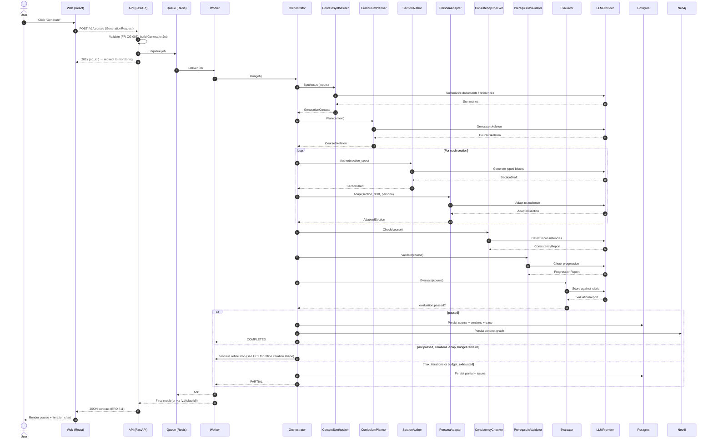
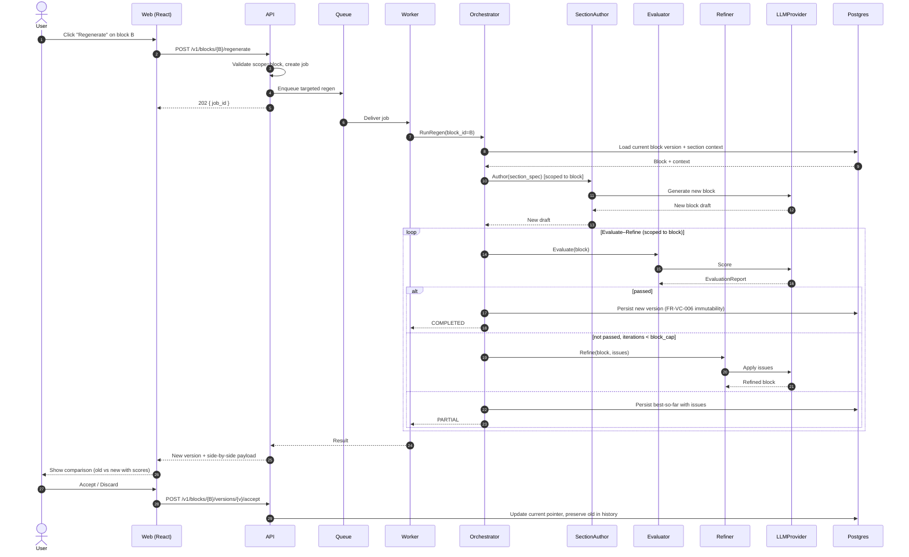
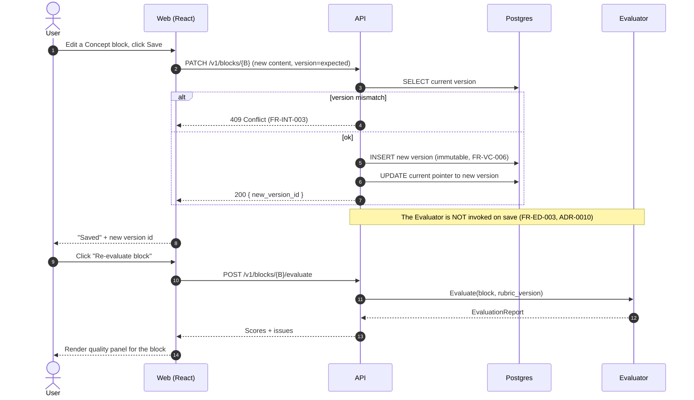
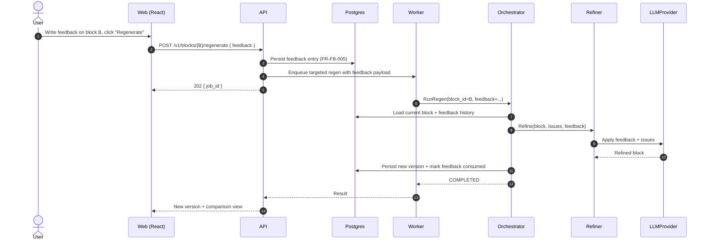
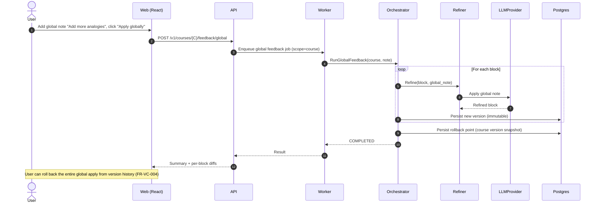
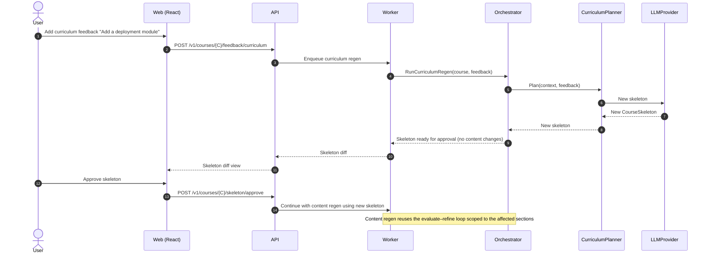
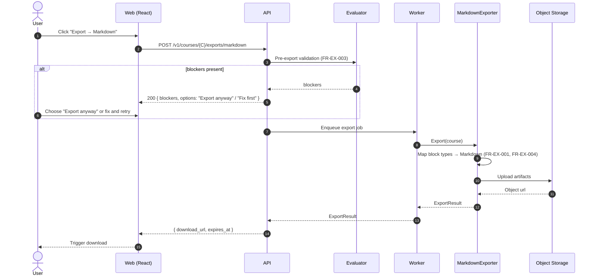
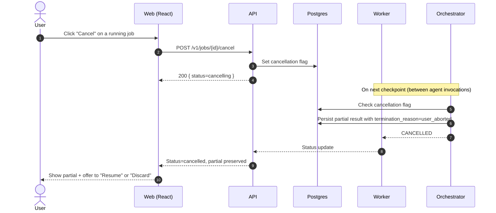
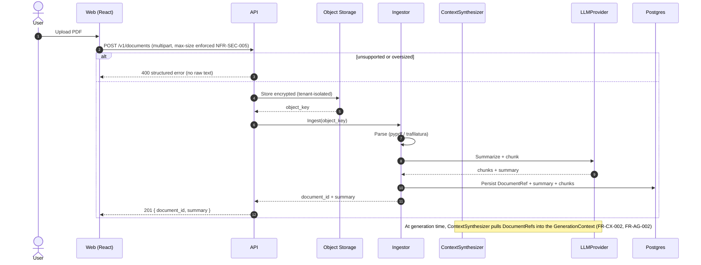
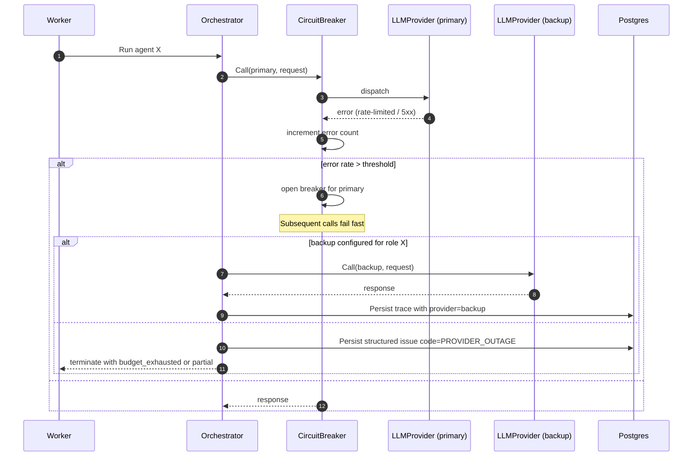

# 10 Sequence Diagrams

> Document type: Architecture — Sequence Diagrams
> Companion to: `07 System Context Diagram.md`, `08 C4 Architecture.md`, `09 Architecture Decision Records.md`
> Status: Draft v0.1 · Owner: Architecture · Last updated: 2026-06-05
> Each diagram uses Mermaid `sequenceDiagram`. Diagrams are illustrative —
> implement with optimistic concurrency, retries, and structured errors.

---

## 1. Document Control

| Field | Value |
|---|---|
| Project codename | CourseForge |
| Document version | 0.1 (Draft) |
| Author | Architecture |
| Reviewers | Backend Lead, AI Lead, Frontend Lead, QA |
| Approvers | Head of Engineering |
| Cadence | Reviewed at the end of each sprint |

---

## 2. Index

| # | Use case | Source FR |
|---|---|---|
| UC1 | Generate a course end-to-end | FR-AG-001, FR-AG-002, FR-AG-010, FR-CG-001 |
| UC2 | Targeted block regeneration | FR-RG-001, FR-RG-004, FR-RG-006 |
| UC3 | Manual edit (no auto-eval) | FR-ED-001, FR-ED-003, FR-VC-006 |
| UC4 | Block-level feedback | FR-FB-001, FR-RG-001 |
| UC5 | Global feedback | FR-FB-004, FR-VC-004 |
| UC6 | Curriculum regeneration | FR-FB-003, FR-AG-003 |
| UC7 | Export to Markdown | FR-EX-001, FR-EX-004 |
| UC8 | Job cancellation | FR-AG-010, FR-NE-001 |
| UC9 | Document upload and ingestion | FR-CX-002, NFR-SEC-005 |
| UC10 | Provider failover | FR-PR-005, ADR-0012 |

---

## 3. UC1 — Generate a course end-to-end

---

## 4. UC2 — Targeted block regeneration

---

## 5. UC3 — Manual edit (no auto-eval)

---

## 6. UC4 — Block-level feedback

---

## 7. UC5 — Global feedback

---

## 8. UC6 — Curriculum regeneration

---

## 9. UC7 — Export to Markdown

---

## 10. UC8 — Job cancellation

---

## 11. UC9 — Document upload and ingestion

---

## 12. UC10 — Provider failover

---

## 13. Notes

- All persistence writes (Postgres, Neo4j) are performed by the
  **Orchestrator**; other components are stateless
  (ADR-0002, FR-AG-001).
- All cross-cutting concerns — idempotency, optimistic concurrency,
  retries, structured errors — are enforced in the application layer
  (FR-INT-002, FR-INT-003, FR-JC-005, NFR-AVAIL-003).
- The agent trace is the **single source of truth** for what actually
  happened during a job (ADR-0011, NFR-OBS-004).

---

## 14. Cross-References

- **System Context** — `07 System Context Diagram.md`
- **C4 Container & Component** — `08 C4 Architecture.md`
- **ADRs** — `09 Architecture Decision Records.md`
- **JSON Output Contract** — `02 Business Requirements Document.md` §11
- **Functional Requirements** — `04 Functional Requirements.md`
- **Non-Functional Requirements** — `05 Non-Functional Requirements.md`
